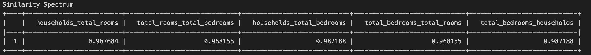

# Libra: deep learning in fluent one-liners
A high-level machine learning API written in Python and Tensorflow that makes training deep neural networks as simple as a one-line function call. 

Table of Contents
=================

* [Prediction Queries: building blocks](#queries)
   * [Regression Neural Network](#regression-neural-network-query)
   * [Classification Neural Network](#classification-neural-network-query)
   * [K-Means Clustering](#k-means-clustering)
   * [Nearest Neighbors](#nearest-neighbors)
   * [Support Vector Machines](#support-vector-machine)
   * [Decision Tree](#decision-tree)
* [Image Generation](#image-generation)
   * [Class Wise Image Generation](#class-wise-image-generation)
   * [Convolutional Neural Networks](#convolutional-neural-network)
* [Plotting](#plotting)
* [Providing Instructions](#instructions)

## Queries ##

### Regression Neural Network Query ###

Let's start with the most basic query. This will build a feed-forward network for a class that you specify
```python
import libra

newClient = client('dataset')
newClient.SingleRegressionQuery('Model the median house value')
```
No preprocessing is neccesary. All plots, losses, and models are stored in the models field in the client class. 

Basic tuning with the number of layers is done when you call this query. If you'd like to automatically more in depth you can call: 

```python
newClient.tune('regression', inplace = False)
```

Calling this tunes hyperparameters like node count, layer count, learning rate, and other features. This will return the best network and if ```inplace = True``` it will replace it in the client class under ```regression_ANN```. 

### Classification Neural Network Query ###

```python
newClient = client('dataset')
newClient.classificationQuery('Predict building name')
newClient.tune('classification')
```
This creates a neural network to predict building names given your dataset. Any number of classes will work for this query. Note that ```categorical_crossentropy``` and an `adam` optimizer is used as a default. This can be changed as well. 

### K-means Clustering ###

```python
newClient = client('dataset')
newClient.kMeansClusteringQuery()
```
### Nearest-neighbors ###

```python
newClient = client('dataset')
newClient.nearestNeighborQuery()
```

This will use scikit's learns nearest neighbor function to return the best nearest neighbor model on the dataset. Values are stored under the ```nearest_neighbor``` field in the model dictionary. 

### Support Vector Machine ###

```python
newClient = client('dataset')
newClient.svmQuery('Model the value of houses')
```

This will use scikit's learns SVM function to return the best support vector machine on the dataset. Values are stored under the ```svm``` field in the model dictionary. 

NOTE: A linear kernel is used as the default, this can be modified by specifying:

```newClient.svmQuery('rbf_kernel')```

### Decision Tree ###

```python
newClient = client('dataset')
newClient.svmQuery()
```

This will use scikit's learns Decision Tree function to return the best decision tree on the dataset. Values are stored under the ```decision_tree``` field in the model dictionary. 

```newClient.decisionTreeQuery('Model the type of cars')```

If you'd like to modify hyperparameters feed them this is the order in which you should provide the parameters:

```decisionTreeQuery(instruction, max_depth, min_samples_split, max_samples_split, min_samples_leaf, max_samples_leaf)```
***

## Image Generation ##

### Class wise image generation ### 
If you want to generate an image dataset to use in one of your models you can do:

```python
generateSet('apples', 'oranges', 'bananas', 'pineapples')
```

This will create seperate folders in your directory with each of these names with around ~100 images for each class. An updated version of Google Chrome is required for this feature. If you'd like to use it with an older version of Chrome please install the appropriate chromedriver. 

### Convolutional Neural Network ###
If you'd like to generate images and fit it automatically to a CNN you can use this command:

```python
newClient.classGenQuery('apples', 'oranges')
```
This will generate a dataset of apples and oranges by parsing google images, prepprocess the dataset appropriately and then fit it to a Convolutional Neural Network. All images are reduced to a standard (224, 224, 3) size using a traditional OpenCV resizing algorithm. Default size is 100 images for each. You can specify this size by adding ```class_size = number_in_each_class```

Note: all images will be resized to (224, 224, 3). Properties are maintained by using a geometric image transformation explained here: 

[OpenCV Transformation](https://docs.opencv.org/2.4/modules/imgproc/doc/geometric_transformations.html)

If you'd like to perform tuning on the CNN you can do this: 

```python
newClient.tuneCNN()
```
Unlike other functions, tuning on the CNN is not done automatically because of how computationally intensive it is. 

***

## Plotting ##
All plots are stored during runtime. This function plots all generated graphs for your current client object on one pane. 

```python
newClient.plotAll()
```

In depth metrics about your dataset and similarity information can be generated by calling:

```python
newClient.stat_analysis() or newClient.stat_analysis(dataset[columname])
```
A information graph as well as a similarity spectrum shown below will be generated:



This represents 5 columns that have the smallest cosine distance: these might need to be removed to reduce noise. You can specify whether you want to remove with ```inplace = True```. If you want to compare just a single column with the dataset you can do:

```python
 newClient.stat_analysis(dataset[columnname])
```

***

Performing dimensionality reduction is as simple as calling:

```python
dimensionalityRedQuery('Perform reduction to model median house value', model_to_fit, depth_of_search):
```

This uses a variety of different reduction techniques and outputs the best pipeline to modify your data. If you want to replace the dataset with the new modified one, you can specify ```inplace = True```.

 
### Instructions ###

Libra uses intelligent part of speech recognition to analyze user instructions and match it with a column in user datasets. 
  1. [Textblob](https://textblob.readthedocs.io/en/dev/), a part of speech recognition algorithm, is used to identify parts of speech.
  2. Self-developed part of speech deciphering algorithm is used to extract relevant parts of a sentence.
  3. Levenshentein distances are used to match relevant parts of the sentence to a column name.
  4. That column name is run through an LSTM Recurrent Neural Network to obtain latent representation.
  5. Both instruction and column latent representation is compared to verify. 
